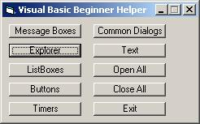



## A Good Beginner Project

### Description

This is just a real simple beginner project aimed to help beginners. I made the code as simple as possible with comments. It has stuff from learning to use commands buttons, to common dialogs, to message boxes and much more. If you like this code, please vote. Thanks.
 
### More Info
 

             |
---                |---
**Submitted On**   |2002-11-19 20:14:36
**By**             |[H1j4x](https://github.com/Planet-Source-Code/PSCIndex/blob/master/ByAuthor/h1j4x.md)
**Level**          |Beginner
**User Rating**    |4.4 (44 globes from 10 users)
**Compatibility**  |VB 6\.0
**Category**       |[Miscellaneous](https://github.com/Planet-Source-Code/PSCIndex/blob/master/ByCategory/miscellaneous__1-1.md)
**World**          |[Visual Basic](https://github.com/Planet-Source-Code/PSCIndex/blob/master/ByWorld/visual-basic.md)
**Archive File**   |[A\_Good\_Beg15003611192002\.zip](https://github.com/Planet-Source-Code/h1j4x-a-good-beginner-project__1-40892/archive/master.zip)

